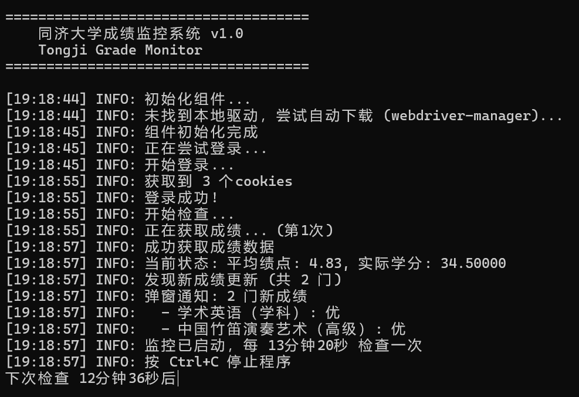
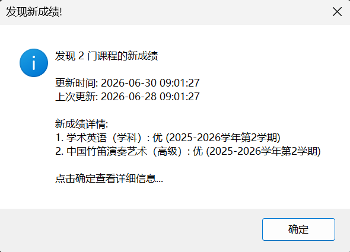
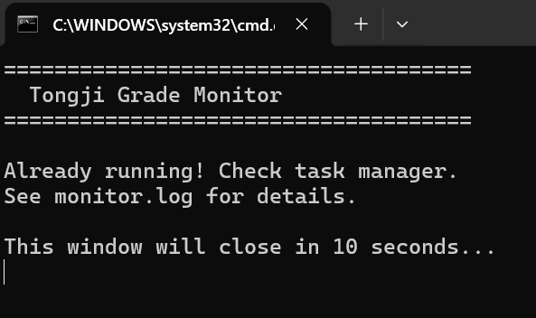

# Tongji Grade Monitor

> 同济大学成绩监控脚本，自动登录教务系统查询成绩更新并弹窗通知。

**本项目不会上传任何个人信息，一切数据仅在本地处理。**





## 功能

- 自动登录同济统一身份认证（Selenium + Chrome 无头模式）
- 定时查询成绩 API（默认每 5 分钟检查一次）
- 发现新成绩时弹窗通知（标题 + 详情 + 声音）
- 成绩历史记录保存（JSON 格式）
- 完整的运行日志（`monitor.log`）
- 支持后台静默运行（`start_bg.bat`）

## 快速开始

### 1. 配置账号

复制 `config.json.example` 为 `config.json`，然后填入你的学号和密码：

```json
{
  "username": "YOUR_STUDENT_ID",
  "password": "YOUR_PASSWORD",
  "check_interval": 800,
  "re_login_interval": 1700,
  "max_retries": 3,
  "headless_mode": true
}
```

| 字段 | 说明 | 默认值 |
|------|------|--------|
| `username` | 学号（同济统一身份认证账号） | — |
| `password` | 密码 | — |
| `check_interval` | 每次成绩检查间隔（秒） | 800 |
| `re_login_interval` | 重新登录间隔（秒） | 1700 |
| `max_retries` | 网络请求最大重试次数 | 3 |
| `headless_mode` | 是否无头模式（不显示浏览器窗口） | true |
| `save_to_file` | 是否保存成绩到本地文件 | true |
| `data_file` | 成绩数据文件名 | `grades_data.json` |
| `log_level` | 日志级别 | INFO |

> ⚠️ 学号获取：登录 [1.tongji.edu.cn](https://1.tongji.edu.cn) 后，在成绩页面 URL 或页面源码中可找到 `studentId` 参数，即为你的学号。

### 2. 安装依赖

```bash
pip install -r requirements.txt
```

### 3. 运行

**前台运行（可看到控制台输出）：**
```bash
python main.py
```

**后台静默运行：**

双击 `start_bg.bat` 即可在后台运行（使用 `pythonw.exe`，无控制台窗口）。如果已经有一个实例在运行，bat 会提示并自动退出。

首次使用建议先前台运行确认配置正确。

### 4. 停止运行

- **前台运行**：按 `Ctrl+C`
- **后台运行**：打开任务管理器结束 `pythonw.exe` 进程

## 定时任务（自动运行）

配合 Windows 任务计划程序可实现每日定时自动检查，详见 `docs/schedule-setup.md`。

常用的触发设置：
- 每天一次，重复间隔 5 小时
- 程序（或脚本）路径：`start_bg.bat`

## 项目结构

```
tongji-grade-monitor/
├── main.py                    # 主程序入口
├── start_bg.bat               # 后台启动脚本
├── config.json.example        # 配置示例
├── requirements.txt           # Python 依赖
├── README.md                  # 本文件
├── .gitignore
├── src/                       # 源代码模块
│   ├── __init__.py
│   ├── login_manager.py       # 登录模块（Selenium）
│   ├── grade_fetcher.py       # 成绩获取模块
│   ├── notifier.py            # 通知弹窗模块
│   └── utils.py               # 工具函数
├── images/                    # 截图展示
├── driver/                    # ChromeDriver 驱动
├── docs/
│   └── schedule-setup.md      # 定时任务设置指南
├── monitor.log                # 运行日志（自动生成）
└── grades_data.json           # 成绩数据（自动生成）
```

## 日志

程序运行时会自动生成 `monitor.log`，记录每次检查的详细信息。遇到问题时可以先查看日志排查。

## 开源说明

本项目基于 MIT 许可证开源。使用前请确保已阅读并理解相关条款。

欢迎 Issue 和 PR！
